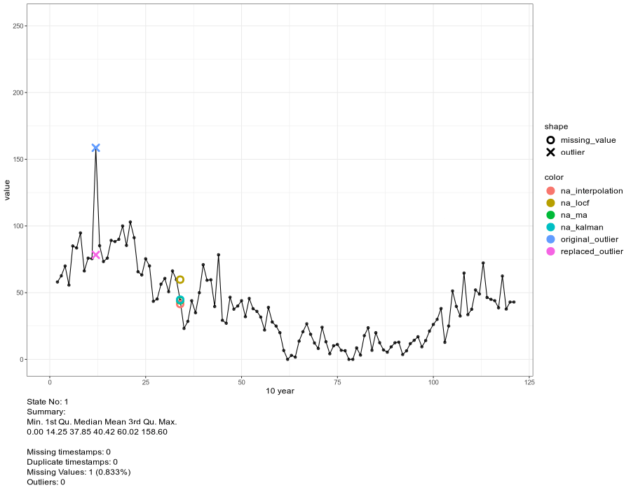

# cleanTS

<!-- badges: start -->

[](https://CRAN.R-project.org/package=cleanTS)
[](https://github.com/Mayur1009/cleanTS/actions/workflows/R-CMD-check.yaml)
[](https://lifecycle.r-lib.org/articles/stages.html#stable)
<!-- badges: end -->

`cleanTS` package focuses on developing a tool for making the process of
cleaning large datasets simple and efficient. Currently it solely
focuses on data cleaning for univariate time series data. The package is
integrated with already developed and deployed tools for missing value
imputation. It also provides a way for visualizing data at different
resolutions, allowing micro-scale visualization. The ultimate goal is
the creation of a handy software tool that deals with the problems,
processes, analysis and visualization of big data time series, with
minimum human intervention.

- `cleanTS()` checks the data for missing and duplicate timestamps,
  performs missing value imputation and removes anomalies/outliers from
  the data.

- `animate_interval()` splits the data and generates an animated plot.

- `interact_plot()` is similar to `animate_interval()` but creates an
  interactive plot which provides relatively more control over the
  animation.

The package can also be used using a shiny application, available at
<https://mayur1009.shinyapps.io/cleanTS/>.

Package Documentation can be found at
<https://mayur1009.github.io/cleanTS/>.

This project was a part of [Google Summer of Code
2021](https://summerofcode.withgoogle.com/projects/#4626948166254592).

## Installation

``` r
# Install release version from CRAN
install.packages("cleanTS")

# Install development version from GitHub
devtools::install_github("Mayur1009/cleanTS")
```

## Example

``` r
library(cleanTS)
#> Registered S3 method overwritten by 'quantmod':
#>   method            from
#>   as.zoo.data.frame zoo

# Read sunspot.month dataset
data <- timetk::tk_tbl(sunspot.month)
print(data)
#> # A tibble: 3,177 × 2
#>    index     value
#>    <yearmon> <dbl>
#>  1 Jan 1749   58  
#>  2 Feb 1749   62.6
#>  3 Mar 1749   70  
#>  4 Apr 1749   55.7
#>  5 May 1749   85  
#>  6 Jun 1749   83.5
#>  7 Jul 1749   94.8
#>  8 Aug 1749   66.3
#>  9 Sep 1749   75.9
#> 10 Oct 1749   75.5
#> # ℹ 3,167 more rows

# Randomly insert missing values to simulate missing value imputation
set.seed(10)
ind <- sample(nrow(data), 100)
data$value[ind] <- NA

# Create `cleanTS` object
cts <- cleanTS(data, date_format = c("my"))
summary(cts)
#>                  Length Class      Mode     
#> clean_data       5      data.table list     
#> missing_ts       0      POSIXct    numeric  
#> duplicate_ts     0      POSIXct    numeric  
#> imp_methods      4      -none-     character
#> mcar_err         4      data.frame list     
#> mar_err          4      data.frame list     
#> outliers         4      data.table list     
#> outlier_mcar_err 4      data.frame list     
#> outlier_mar_err  4      data.frame list

# Cleaned Data
head(cts$clean_data)
#>          time value missing_type method_used is_outlier
#> 1: 1749-01-01  58.0         <NA>        <NA>      FALSE
#> 2: 1749-02-01  62.6         <NA>        <NA>      FALSE
#> 3: 1749-03-01  70.0         <NA>        <NA>      FALSE
#> 4: 1749-04-01  55.7         <NA>        <NA>      FALSE
#> 5: 1749-05-01  85.0         <NA>        <NA>      FALSE
#> 6: 1749-06-01  83.5         <NA>        <NA>      FALSE

# Genearate animated plot
a <- animate_interval(cts, interval = "10 year")
gen.animation(a, height = 700, width = 900)
```

<!-- -->

``` r
# Generate interactive plot
interact_plot(cts, interval = "10 year")
```
